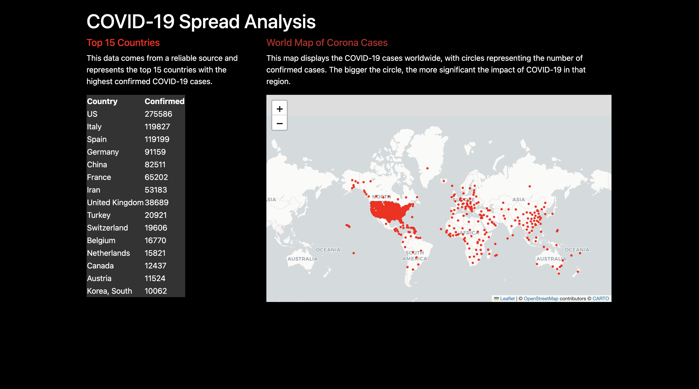
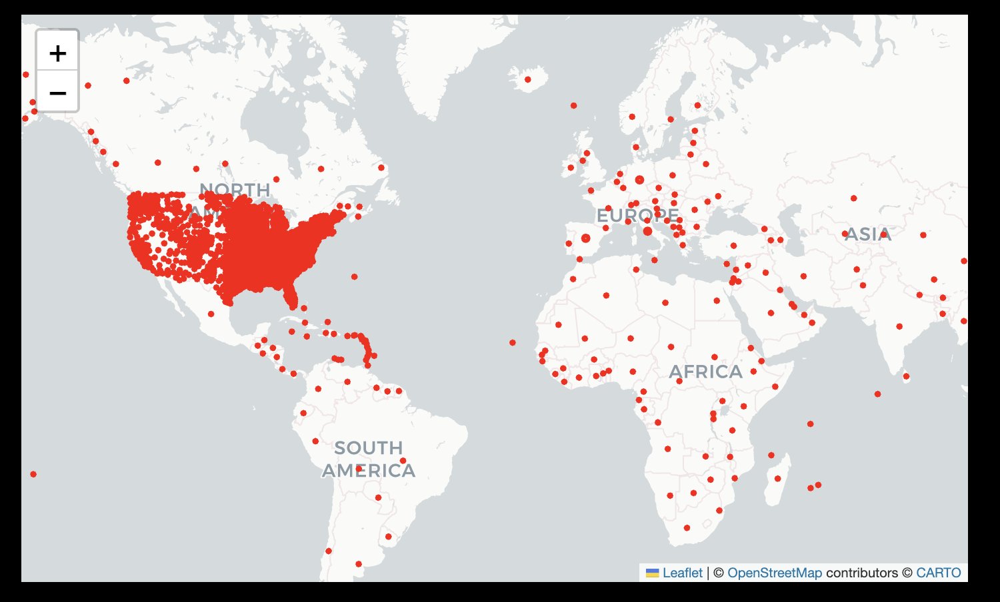

# 🌍 COVID-19 Global Spread Analysis Dashboard

  
*Interactive dashboard showing COVID-19 statistics and geographical distribution*

## 📊 Key Features
- **Interactive World Map**
  - Proportional circles visualize case severity
  - Hover/click interactions for detailed case numbers
- **Top Countries Ranking**
  - Auto-generated top 15 affected nations
  - Real-time data processing with Pandas
- **Clean Visualization**
  - Color-coded for intuitive understanding
  - Responsive design works on all devices

## 🛠️ Technical Stack
| Component       | Technology Used |
|----------------|----------------|
| Backend        | Python Flask   |
| Data Processing| Pandas         |
| Visualization  | Folium         |
| Frontend       | HTML5/CSS3     |
| Map Tiles      | CartoDB        |

## 🚀 Quick Start

### Prerequisites
- Python 3.7+
- pip package manager

### Installation
1. Clone the repository:
   ```bash
   git clone https://github.com/your-username/covid-19-spread-analysis.git
   cd covid-19-spread-analysis
2. Install dependencies:
   ```bash
   pip install flask folium pandas
3. Add your dataset:
 - Place covid-19-dataset-1.csv in project root
 - Ensure it contains columns: Lat, Long_, Confirmed, Country_Region   
 - pip install flask folium pandas
### Running the Application
    python app.py
- Access dashboard at: http://localhost:5000

### 📈 Understanding the Dashboard
- 🏆 Top Countries Table
-  
  - Displays ranked list of most affected countries with:
  - Country name
  - Total confirmed cases
- 🗺️ Interactive World Map
-  
  - Map Section
  - Circle Size: Proportional to case numbers
  - Color Coding: Red intensity indicates severity
- 🖱️ Interactions
  - Hover: See location name
  - Click: View detailed case count
 
- **📂 Project Structure**
- ```bash
  ├── app.py                # Main application
  ├── requirements.txt      # Dependencies
  ├── covid-19-dataset-1.csv # Dataset
  ├── templates/
  │   └── home.html         # Dashboard UI
  │   └── base.html         # Base template
  └── static/               
      └── style.css         # Custom styling

## 📊 Results and Insights

- 🔴 **Interactive Map Visualization**: The application displays red circular markers on a map, where each circle's size is proportional to the number of confirmed cases in that region.
- 🌐 **Country-wise Statistics Table**: A dynamic table lists the top affected countries with their total confirmed cases, making it easy to compare severity across nations.
- 🔍 **Quick Overview**: Users can instantly identify COVID-19 hotspots by hovering over map circles, which display location-specific case data.
- 📍 **Geographical Distribution**: The map helps visualize how the virus has spread geographically, highlighting densely affected areas.
- 🧾 **Clean Data Representation**: Null or missing values are removed to ensure reliable and clean data display on both the map and the country table.
- ⚡ **Fast Performance**: Powered by Flask and optimized with lightweight libraries, the app loads quickly even with a large dataset.

- These insights aim to help users, researchers, and policymakers better understand the global spread and intensity of the COVID-19 pandemic through visual and tabular data representation.
  
## 📃 License
- This project is licensed under the MIT License. 

## 🙏 Acknowledgments

- [Johns Hopkins University CSSE](https://github.com/CSSEGISandData/COVID-19) — for providing open-source COVID-19 dataset.
- [Folium](https://python-visualization.github.io/folium/) — for interactive map rendering in Python.
- [Flask](https://flask.palletsprojects.com/) — lightweight framework for building the web interface.
- Stack Overflow and the Python community — for helping resolve challenges during development.

---
